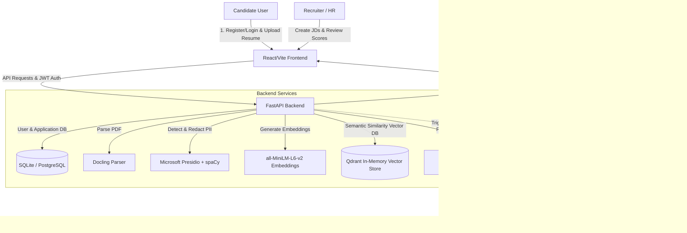

# 📄 ResumeAI ATS — AI-Powered Applicant Tracking System

Welcome to **ResumeAI ATS**, a dual-interface, AI-driven Applicant Tracking System. This project automates the resume screening process by parsing PDF documents, anonymizing PII (Personally Identifiable Information) to prevent recruitment bias, performing similarity searches via vector embeddings, and scoring/ranking candidates against Job Descriptions using an LLM.

---

## 🏗️ Architecture Overview

The system consists of a **FastAPI backend** (serving REST endpoints and WebSocket notifications), a **Vite + React frontend** (providing candidate and recruiter dashboards), and integrates AI components for RAG (Retrieval-Augmented Generation) and PII redaction.



---

## ✨ Feature Highlights

*   👥 **Dual-Interface Dashboards**: 
    *   **Candidate Portal**: Job listing views, resume upload dropzones, application status logs, and feedback notifications.
    *   **Recruiter Portal**: Job creation forms, candidate rosters sorted by AI score, visual analysis graphs, and status controls (Approve/Reject).
*   🤖 **AI Screen & Match scoring**: Evaluates candidate resumes against target job descriptions, outputting a match score (0-100), detailed strengths/weaknesses justification, and interview question suggestions.
*   🔒 **PII Redaction & Privacy**: Integrates Microsoft Presidio and spaCy to search for and anonymize sensitive information (names, emails, phones) before parsing/sending to external LLMs, ensuring unbiased hiring.
*   💬 **AI Assistant (RAG Chatbot)**: Includes a real-time virtual assistant to answer questions about candidate applications or platform capabilities.
*   ⚡ **Real-Time WebSockets**: Instantly pushes recruitment progress, application receipts, and processing completions directly to the frontend dashboards.
*   📬 **Automated Email Notifications**: Integrates SMTP (with Fernet encrypted credentials) and supports n8n automation for select/reject candidate communications.

---

## 🛠️ Technology Stack

### Backend
*   **Framework**: FastAPI (Python 3.10+)
*   **Parsing**: Docling (high-fidelity PDF-to-Markdown)
*   **PII Anonymization**: Microsoft Presidio Analyzer & Anonymizer + `en_core_web_lg` spaCy models
*   **Orchestration**: LangChain, LangChain Hugging Face, and LangSmith (optional tracing)
*   **Vector Database**: Qdrant (In-Memory collection)
*   **Primary DB**: SQLite (for zero-setup dev) and PostgreSQL (for production)
*   **Authentication**: JWT (JSON Web Tokens) with `bcrypt` password hashing

### Frontend
*   **Framework**: React 19 (Vite)
*   **Styling**: TailwindCSS
*   **Animations**: Framer Motion
*   **Charts**: Recharts (for visual application demographics and score distributions)
*   **Icons**: Lucide React

---

## 📂 Repository Structure

*   [`backend/`](file:///c:/College/Resume-ats_AI/backend): FastAPI source code, routers, services, database configurations, and environment configurations.
*   [`frontend/`](file:///c:/College/Resume-ats_AI/frontend): React SPA, state contexts, dashboard views, custom components, and asset configurations.
*   [`documents/`](file:///c:/College/Resume-ats_AI/documents): Project design documentation, canvases, and archive reports.
*   [`Makefile`](file:///c:/College/Resume-ats_AI/Makefile): Automation commands to install dependencies, run developments servers, and clean caches.

---

## 🚀 Getting Started

### Prerequisites
*   Python 3.10 or higher installed.
*   Node.js (v18+) and npm installed.
*   A Hugging Face Account and API Token (for LLM inference).

### Quick Setup

You can run the entire workspace using the provided [`Makefile`](file:///c:/College/Resume-ats_AI/Makefile):

1.  **Clone the repository**:
    ```bash
    git clone https://github.com/your-username/Resume-ats_AI.git
    cd Resume-ats_AI
    ```

2.  **Install all dependencies**:
    ```bash
    make install
    ```
    *This runs `pip install` inside the backend directory and `npm install` inside the frontend.*

3.  **Configure Environment Variables**:
    *   Navigate to [`backend/`](file:///c:/College/Resume-ats_AI/backend) and copy `.env.example` to `.env`.
        ```bash
        cp backend/.env.example backend/.env
        ```
    *   Populate your `HUGGINGFACEHUB_API_TOKEN` and make any adjustments to database or authentication secrets. Refer to the **Environment Configuration** section below.

4.  **Run Development Servers**:
    *   In terminal 1, launch the FastAPI backend:
        ```bash
        make dev-backend
        ```
    *   In terminal 2, launch the Vite frontend:
        ```bash
        make dev-frontend
        ```

5.  **Verify Setup**:
    *   Open your browser and navigate to `http://localhost:5173`.
    *   The API Swagger documentation will be available at `http://localhost:8001/docs`.

---

## ⚙️ Environment Configuration

Here are the key environment configurations required in [`backend/.env`](file:///c:/College/Resume-ats_AI/backend/.env):

| Variable | Description | Default / Example |
| :--- | :--- | :--- |
| `HUGGINGFACEHUB_API_TOKEN` | Required token to authenticate with Hugging Face Hub | `hf_...` |
| `MATCHER_REPO_ID` | LLM used for candidate evaluation and scoring | `Qwen/Qwen2.5-7B-Instruct` |
| `CHATBOT_REPO_ID` | LLM used for chatbot support RAG agent | `meta-llama/Llama-3.1-8B-Instruct` |
| `EMBEDDINGS_MODEL` | Embedding model for vector semantic searches | `sentence-transformers/all-MiniLM-L6-v2` |
| `DATABASE_URL` | SQLAlchemy Connection URI (PostgreSQL or SQLite) | `sqlite:///./resumes.db` |
| `JWT_SECRET` | Secret key to encrypt and verify JWT tokens | *Use a secure random string* |
| `SMTP_EMAIL` | Credentials for automated HR email notifications | `your-email@gmail.com` |
| `SMTP_ENCRYPTION_KEY` | Fernet key for encrypting SMTP credentials in DB | *Generate using Fernet* |

> [!IMPORTANT]
> **Outbound SMTP Port Blocks on Render Free Tier**:
> Standard SMTP ports (`25`, `465`, `587`) are **blocked** on Render's Free Tier, which causes direct Gmail SMTP connection timeouts. 
> 
> **How to make it work:**
> * **Option A (Local Testing)**: Test it locally on your computer using standard Gmail SMTP on port `587`, as local ISPs do not block SMTP traffic.
> * **Option B (Free Production Bypass)**: Configure your global fallback and HR custom settings to use an SMTP relay provider (such as Brevo) that supports **Port `2525`** (which Render does *not* block).
> * **Option C (Clean Production Setup)**: Upgrade your Render Web Service to any paid tier (starting at $7/month), which instantly unblocks ports `587` and `465`.
> 
> For full details, see the [Deployment & Troubleshooting Guide](file:///c:/College/Resume-ats_AI/documents/documentation/deployment_troubleshooting.md#Issue-7b-HR-Email-Settings--SMTP-Port-Blocks-on-Render-Free-Tier).

---

## 🤖 n8n Automation (Optional)

The application is structured to trigger optional webhook notifications to an **n8n** server for:
1.  **Backup Storage**: Automatically uploading candidate resume PDFs to a secure company Google Drive directory.
2.  **Custom Email Workflows**: Sending complex HTML selection or rejection updates to applicants based on recruiter status adjustments.

To configure n8n, point the webhook configurations in your settings router to your active n8n trigger URL.

---

## 📝 License

This project is licensed under the MIT License.
